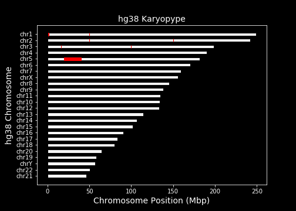

[](https://circleci.com/gh/jakevc/karyopype)

# karyopype

Karyopype is a simple chromosome plotting package in python allowing you to quickly visualize where a set of genomic regions, or multiple sets of genomic regions fall on the chromosomes.


From an interactive python session (jupyter notebook):
```python
pip install karyopype
import karyopype.karyopype as kp

kp.plot_karyopype("hg38", "/path/to/regions.bed")
```



From a command line session
```python
pip install karyopype
python
>>> import karyopype.karyopype as kp
# save plot to current directory
>>> kp.plot_karyopyp("hg38", "/path/to/regions.bed", savefig=True)
```