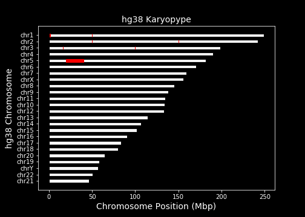

[](https://circleci.com/gh/jakevc/karyopype)

# karyopype

Karyopype is a simple chromosome plotting package in python allowing you to quickly visualize where a set of genomic regions, or multiple sets of genomic regions fall on the chromosomes.


```
import karyopype

plot_chromosomes("hg38", "/path/to/regions.bed")
```

